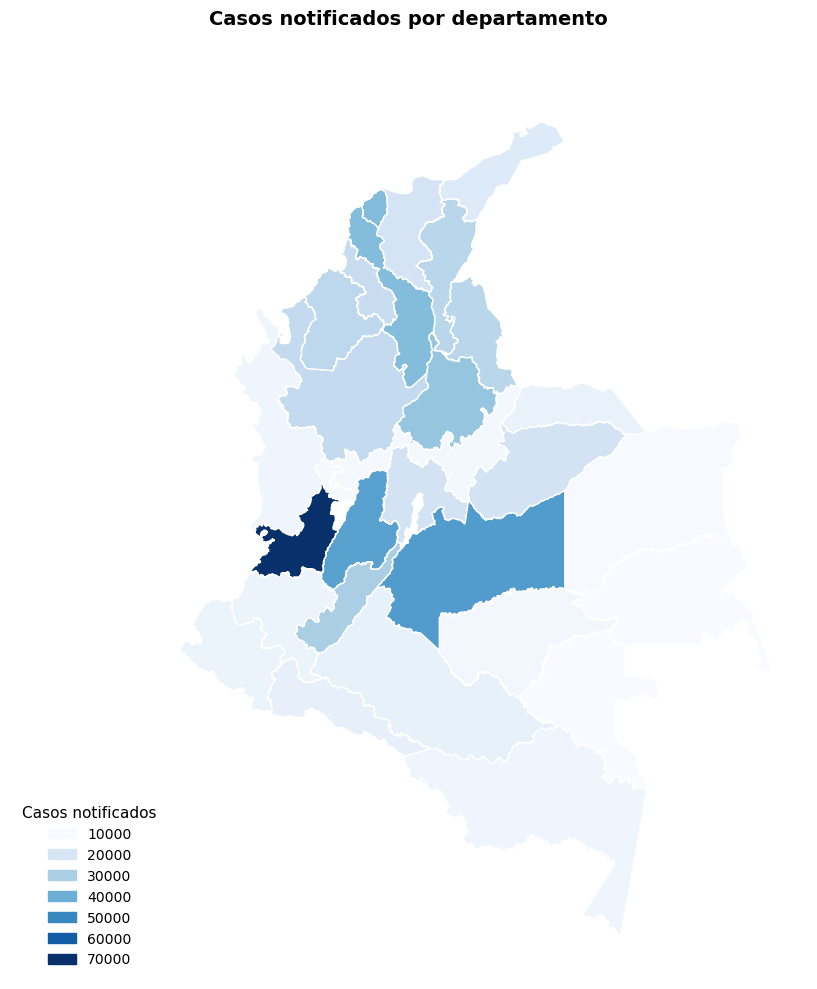
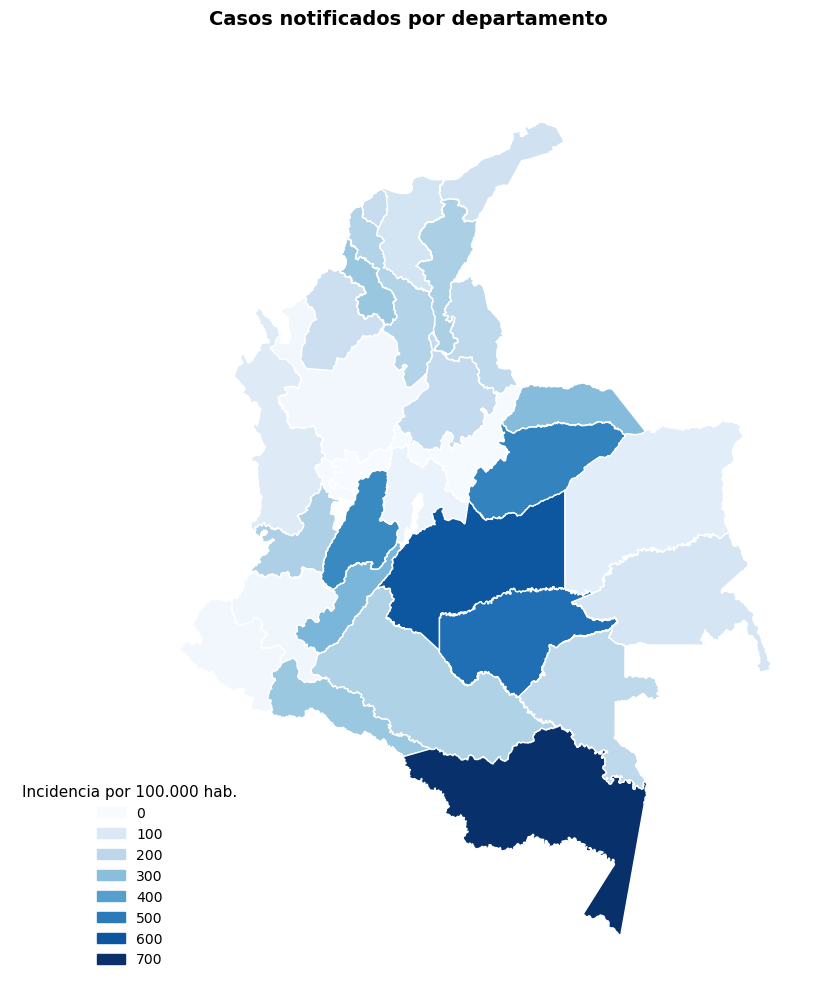
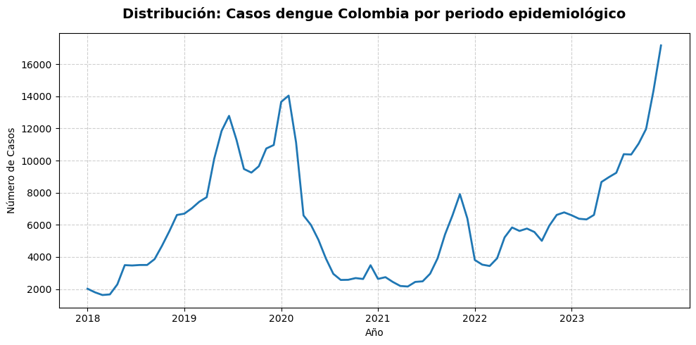
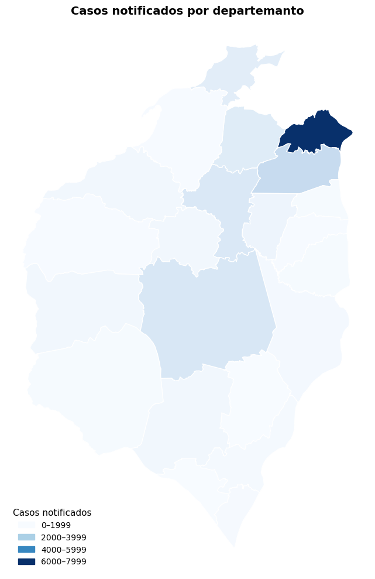
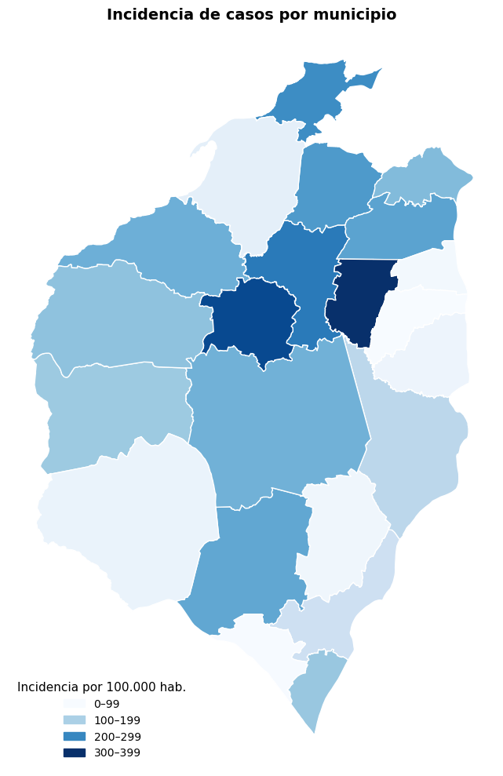
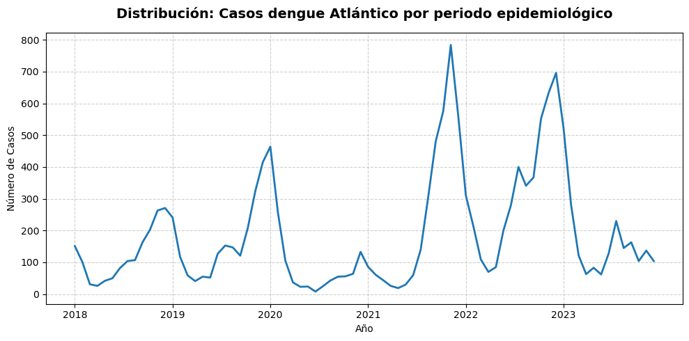

# **Caracterización de casos de Dengue**

El dengue es una enfermedad febril aguda de etiología viral, transmitida por vectores del género *Aedes* (*A. aegypti* y *A. albopictus*). Según la [Organización Mundial de la Salud (OMS, 2023)](https://www.who.int/es/news-room/fact-sheets/detail/dengue-and-severe-dengue), constituye una de las mayores cargas sanitarias en regiones tropicales y subtropicales, con un estimado de 390 millones de infecciones anuales a nivel global. Su espectro clínico abarca desde cuadros leves hasta formas graves potencialmente mortales, lo que convierte su vigilancia y control en una prioridad de salud pública.

A nivel mundial, el dengue constituye una de las enfermedades virales transmitidas por mosquitos de mayor expansión geográfica, con presencia en más de 120 países. En Colombia, el dengue representa un problema prioritario de salud pública debido a su patrón endemo-epidémico y afecta al 73.3% de los municipios, según el [Instituto Nacional de Salud (INS, 2024)](https://www.ins.gov.co), lo que evidencia su amplia distribución territorial. 

La dinámica del dengue en el país está ligada a condiciones locales de temperatura, lluvia y humedad. Esta interacción genera variaciones regionales marcadas y un comportamiento no estacionario, con fluctuaciones que dependen tanto de la época del año como de los ciclos climáticos de mayor escala [(E. Muñoz, 2021)](https://doi-org.ezproxy.uninorte.edu.co/10.1016/j.actatropica.2021.106136 ). En el plano institucional, Colombia cuenta con un marco regulatorio que sustenta la vigilancia del evento a través del Sistema Nacional de Vigilancia en Salud Pública (SIVIGILA), que establece la notificación obligatoria de los casos. Asimismo, el Plan Decenal de Salud Pública 2022–2031 incorpora estrategias de prevención, control vectorial y educación comunitaria orientadas a reducir la transmisión.

Para el análisis de la dinámica del dengue en el país, se utilizaron los registros oficiales reportados al SIVIGILA, fuente primaria de información epidemiológica en Colombia. A partir de esta base de datos se realizó una caracterización descriptiva de 491,869 registros correspondientes al periodo 2018-2023, que incluye la distribución temporal de los casos, la incidencia ajustada por población expuesta y los patrones demográficos asociados al evento. 

___________

Durante el periodo analizado, la mayor proporción de casos correspondió a personas en edad adulta (18–59 años), con un 32.6% del total. Le siguieron los niños en primera infancia (1-5 años), con un 24.4%, y los adolescentes (12-17 años), con un 21.9%. En contraste, las personas mayores de 60 años representaron apenas el 5%. En cuanto al sexo, los casos fueron ligeramente más frecuentes en masculinos (52,4%) que en femeninas (47.6%). Solo el 5.5% de los casos correspondió a grupos étnicos reconocidos (afrocolombianos, indígenas o ROM). Con respecto al régimen de afiliación en salud, el 52.2% pertenecía al régimen subsidiado, el 39.3% al contributivo y el 8.4% a otros tipos.

En términos clínicos, el conjunto de casos estuvo conformado por 485,139 diagnósticos de dengue clásico y 6,730 de dengue grave. El 70.2% de los registros correspondió a casos probables, mientras que el resto fueron confirmados por laboratorio o nexo epidemiológico. Aproximadamente el 48.4% de los pacientes requirió hospitalización y se registraron 158 muertes asociadas a dengue grave durante el periodo de estudio. 

La distribución espacial de los casos mostró que la mayor concentración de registros se presentó en el departamento del Valle del Cauca, que aportó el 15.3% del total nacional. Posteriormente, la carga de enfermedad se concentró en otros departamentos de alta notificación: Meta (8.9%) y Tolima (8.6%) conformaron un bloque con más de 40.000 registros. A estos les siguió el conjunto de Atlántico, Bolívar y Santander, con más de 30.000 notificaciones cada uno. En contraste, departamentos de baja densidad poblacional —como San Andrés, Providencia y Santa Catalina, Guainía, Vaupés y Vichada— reportaron menos de 1.000 casos durante el periodo analizado. Sin embargo, al examinar el riesgo poblacional mediante la incidencia, emergió un patrón diferente. El departamento del Amazonas registró la mayor incidencia del país, con 784 casos por cada 100.000 habitantes. Le siguieron Meta, Guaviare, Casanare y Tolima, territorios donde la intensidad de la transmisión fue elevada, superando los 500 casos por cada 100.000 habitantes.

El comportamiento temporal de dengue entre 2018 y 2023 mostró un patrón de fluctuaciones multianuales. Los picos epidémicos más elevados se presentaron en 2019 y 2023, con 124,989 y 128,132 notificaciones respectivamente. Estos repuntes contrastaron con los descensos observados en  2020 y 2021, cuando los casos disminuyeron a 77,281 y 50,265, posiblemente influenciados por restricciones asociadas a la pandemia por COVID-19. Los años intermedios, como 2018 (44,171) y 2022 (67,031), presentaron niveles moderados, configurando un patrón clínico característico del dengue en el país. 

El análisis gráfico confirma un comportamiento cíclico y estacional, con incrementos sostenidos en los primeros meses de cada año y descensos posteriores. Dos picos epidémicos destacan de manera clara: uno a finales de 2019 e inicios de 2020, y otro más pronunciado hacia el segundo semestre de 2023. Tras el pico de 2020 se observó un descenso abrupto que marcó un periodo de baja transmisión entre 2020 y 2021. A partir de 2022 se evidenció un nuevo incremento, con fluctuaciones mensuales pero con una tendencia general al alza que culminó en un repunte epidémico a finales de 2023. 

____

Si bien el análisis nacional permite comprender el comportamiento general del dengue en el país, resulta necesario profundizar en dinámicas territoriales específicas. Situamos el contexto territorial en el departamento del Atlántico. Ubicado en la región caribe y conformado por 22 municipios y el Distrito Especial de Barranquilla, presenta condiciones climáticas de tipo tropical con variaciones entre estepa, sabana y zonas semiáridas, particularmente en áreas cercanas al río Magdalena y franja costera. La combinación de factores climáticos y la alta concentración urbana genera condiciones favorables para la reproducción del vector _Aedes aegypti_. Estas características hacen del Atlántico un escenario estratégico para analizar patrones locales de transmisión.

En el Atlántico, exceptuando la ciudad de Barranquilla, la distribución de los casos de dengue por ciclo vital muestra una marcada concentración en población infantil y adolescente. La infancia mayor (6-11 años) agrupa 30.5% de los casos, seguida de la adolescencia (12-17 años) con el 29.8%; en conjunto representan más de la mitad de las notificaciones. En tercer lugar se ubica la población adulta (18-59 años) con el 24.9%, mientras que la infancia menor (1-5 años) aporta el 12.6%. Este patrón difiere observado a nivel nacional, donde la carga tiende a concentrarse en población adulta, evidenciando que en el Atlántico la transmisión afecta especialmente a grupos en edades tempranas. 

En cuanto al perfil demográfico y la afiliación al sistema de salud, el comportamiento es similar al escenario nacional: los masculinos representan el 52.3% de los casos, manteniendo una ligera predominancia sobre las mujeres. Asimismo, el 53.4% de los pacientes pertenece al régimen subsidiado, seguido del 39.8% del régimen contributivo y un 6.8% correspondiente a otras modalidades de aseguramiento. Respecto a la severidad del evento, el 63.9% requirió hospitalización, se cuentan 380 casos (2.6%) de dengue grave; de ellos y dada la enfermedad se registraron 7 fallecimientos.

La distribución municipal evidencia grandes contrastes territoriales. Soledad concentra el 46% de todos los casos del departamento (6,673 registros), superando ampliamente a los demás municipios. Le siguen Malambo (11.5%), Sabanalarga (7.5%) y Baranoa (7.0%), configurando los principales focos urbanos de transmisión. Por el contrario, municipios como Santa Lucía, Santo Tomás, Piojó, Tubará y Candelaria aportan menos del 1% de las notificaciones, lo que puede reflejar tanto baja transmisión como poblaciones más pequeñas. Al analizar la incidencia, emergen patrones distintos a los observados por número absoluto de casos. Los municipios con mayor riesgo relativo de enfermar son Polonuevo (336.78 casos por 100,00 habitantes), Usiacurí (308.66) y Baranoa (251.9). Puerto Colombia, Galapa y  Malambo también presentan incidencias altas, superiores a los 200 casos por 100,000 habitantes. En contraste, Sabanagrande, Santa Lucía, Santo Tomás y Candelaria registran incidencias por debajo de los 50 casos por 100,000 habitantes, mostrando áreas de menor transmisión dentro del territorio. De esta manera, la zona céntrica del departamento es la que mayor incidencia de casos presenta, seguido por la zona metropolitana.

La dinámica temporal del dengue en el Atlántico presenta un comportamiento fluctuante y marcadamente estacional. Los años con mayor número de casos fueron 2021 (3,172) y 2022 (4,257), contrastando con los descensos observados en 2020 y 2023, cuando las notificaciones bajaron a 1,295 y 2,144 respectivamente. La serie por periodo epidemiológico entre 2018 y 2023 evidencia varios picos relevantes: uno a finales de 2019 e inicios de 2020 con cerca de 450 casos por periodo; un segundo y más alto en 2022 (más de 780); y otro hacia finales de 2023 (alrededor de 700). A lo largo de toda la serie se observan ciclos de incrementos rápidos seguidos por descensos bruscos. El patrón general indica un descenso en la primera mitad del año y un aumento marcado en la segunda, configurando un comportamiento cíclico y estacional.

______

Luego de caracterizar el comportamiento epidemiológico del dengue en el departamento del Atlántico, es pertinente examinar los factores del entorno que pueden influir en la transmisión del virus. Entre estos, las variables climáticas desempeñan un papel fundamental, dado que condicionan tanto la presencia del Aedes aegypti como la velocidad de su ciclo de vida y la replicación viral. En particular, estudios recientes han demostrado que la combinación de precipitación, temperatura media y humedad relativa constituye uno de los conjuntos de predictores más robustos para explicar la variabilidad espacial y temporal del dengue. Por ejemplo, el trabajo de [Pérez-Castellanos et al. (2024)](https://doi.org/10.1371/journal.pone.0311607) encontró que estas tres variables, especialmente cuando se consideran bajo efectos no lineales y rezagados, ofrecen el mejor ajuste estadístico. Con base en esta evidencia, el presente estudio incorpora precipitación, temperatura y humedad relativa como variables para explorar la relación entre condiciones del entorno y comportamiento epidemiológico del dengue en el Atlántico.

______

Para este estudio se incorporó la Razón Estandirizada de morbilidad (REM) como indicador complementario a la incidencia, con el fin de capturar diferencias en el riesgo epidemiologico que no se explican unicamente por el tamaño poblacional o el numero absoluto de casos. Mientras la incidencia muestra la frecuencia de la enfermedad ajustada por la población, el REM permite comparar cada municipio contra un patrón de referencia departamental, identificando terriotrios donde la carga observada supera o se encuentra debajo de lo esperado. Su utilidad radica en que revela dsigualdades relativas 
en la transmisión del dengue, permitiendo reconocer áreas con un riesgo inusualmente alto - pontenciales escenarios de brote, condiciones ambientales favorables o brechas en vigilancia- así como municipios que mantienen una transmisión por debajo del nivel esperado. En conjunto, ambos indicadores ofrecen una visión más precisa de las dinámicas locales del dengue en el Atlántico durante el periodo 2018-2023.

| Municipio        | Casos Observados | Proporción | Población | Incidencia | Casos Esperados |   REM   |
|------------------|-------|------------|-----------|------------|-----------|---------|
| BARANOA          | 1021  | 0.070      | 405184    | 251.98     | 681.512   | 1.49814 |
| CAMPO DE LA CRUZ | 147   | 0.010      | 147981    | 99.34      | 248.785   | 0.59087 |
| CANDELARIA       | 52    | 0.004      | 104398    | 49.81      | 175.695   | 0.29597 |
| GALAPA           | 837   | 0.058      | 391774    | 213.64     | 657.891   | 1.27225 |
| JUAN DE ACOSTA   | 249   | 0.017      | 134313    | 185.39     | 225.477   | 1.10433 |
| LURUACO          | 271   | 0.019      | 181093    | 149.65     | 304.225   | 0.89079 |
| MALAMBO          | 1675  | 0.115      | 832032    | 201.31     | 1398.510  | 1.19770 |
| MANATÍ           | 253   | 0.017      | 128844    | 196.36     | 216.718   | 1.16742 |
| PALMAR DE VARELA | 100   | 0.007      | 188904    | 52.94      | 317.916   | 0.31455 |
| PIOJÓ            | 69    | 0.005      | 42781     | 161.29     | 71.924    | 0.95934 |
| POLONUEVO        | 394   | 0.027      | 116997    | 336.76     | 196.548   | 2.00460 |
| PONEDERA         | 186   | 0.013      | 152362    | 122.08     | 255.750   | 0.72727 |
| PUERTO COLOMBIA  | 766   | 0.053      | 333634    | 229.59     | 563.463   | 1.35945 |
| REPELÓN          | 95    | 0.007      | 167696    | 56.65      | 281.551   | 0.33742 |
| SABANAGRANDE     | 94    | 0.006      | 211268    | 44.49      | 355.591   | 0.26435 |
| SABANALARGA      | 1083  | 0.075      | 590598    | 183.37     | 990.362   | 1.09354 |
| SANTA LUCÍA      | 41    | 0.003      | 104634    | 39.18      | 176.092   | 0.23283 |
| SANTO TOMÁS      | 73    | 0.005      | 195560    | 37.33      | 329.282   | 0.22170 |
| SOLEDAD          | 6673  | 0.460      | 3935846   | 169.54     | 6619.400  | 1.00810 |
| SUAN             | 119   | 0.008      | 77623     | 153.31     | 130.573   | 0.91137 |
| TUBARÁ           | 74    | 0.005      | 112015    | 66.06      | 188.210   | 0.39318 |
| USIACURÍ         | 250   | 0.017      | 80996     | 308.66     | 136.519   | 1.83125 |

La tabla presenta, para cada municipio del departamento del Atlántico (exceptuando Barranquilla), la tasa de incidencia acumulada del dengue y el REM correspondientes al periodo **2018–2023**. Estos indicadores permiten comparar la carga de enfermedad entre municipios con diferentes tamaños poblacionales y evaluar si el número de casos registrados es coherente con lo que se esperaría según el comportamiento epidemiológico del territorio.

Municipios como **Soledad, Sabanalarga, Baranoa, Puerto Colombia, Galapa** y **Malambo** presentan tanto una alta incidencia acumulada como valores de REM superiores a 1, lo que indica un riesgo mayor al esperado y una transmisión más intensa o sostenida. Otros municipios más pequeños, como **Polonuevo** y **Usiacurí**, destacan por REM particularmente elevados pese a su baja población, sugiriendo brotes localizados o condiciones de vulnerabilidad específicas. En contraste, municipios como **Campo de la Cruz, Candelaria, Sabanagrande, Santo Tomás, Palmar de Varela** o **Repelón** muestran tanto incidencia como REM por debajo del promedio, reflejando una menor transmisión.

Autoras: 
* Daniella Guerra Gutiérrez
* Tawny Torres Caballero

Tutores:
* PhD. Karen Florez Lozano
* Edgar Navarro