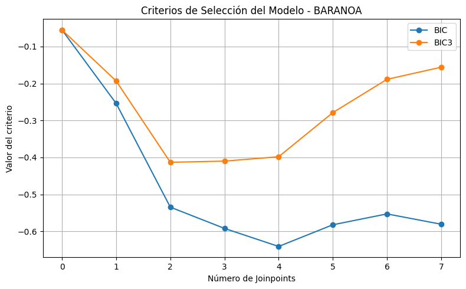
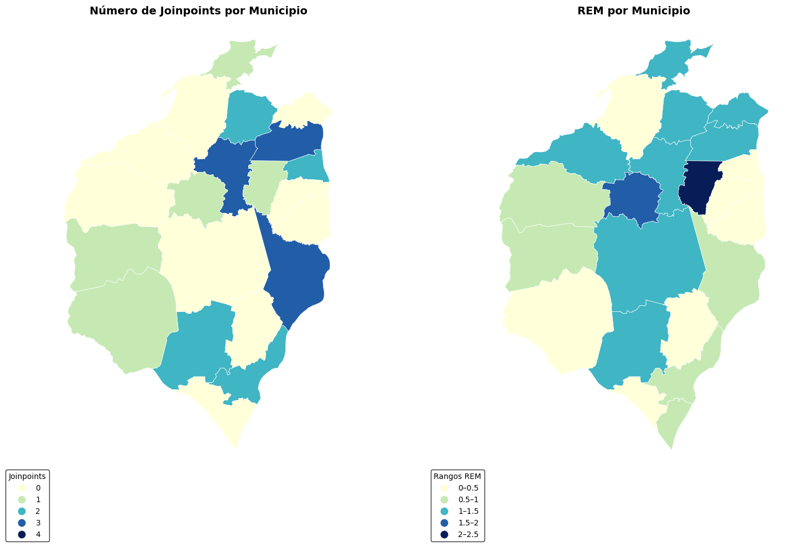

# **Análisis de Tendecias Espacio-Temporales de la Razón Estandarida del Dengue en el Atlántico (2018-2023) utilizando Joinpoint Regression Model**

## **Introducción**

El análisis de tendencias temporales es una herramienta fundamental para comprender la evolución de eventos epidemiológicos y anticipar posibles escenarios de riesgo. En este informe se examina el comportamiento de la Razón Estandarizada de Morbilidad (REM) por dengue en los municipios del departamento del Atlántico durante el periodo 2018–2023, con el propósito de identificar patrones de aumento, disminución o estabilidad a lo largo del tiempo.

Para ello se emplea el Modelo de Regresión Joinpoint, una metodología que permite detectar puntos de cambio (“joinpoints”) donde la trayectoria de la serie temporal presenta modificaciones significativas. Estos puntos marcan intervalos con dinámicas distintas y permiten caracterizar segmentos con tendencias crecientes, decrecientes o estables, aportando así una lectura más precisa sobre la evolución del indicador.

-----
## **Modelo Joinpoint**

El análisis se realizó a partir de una base de datos estructurada por tres variables clave: Municipio, Periodo global y REM. Primero, para 'Municipio' se incluyeron todos los municipios del Atlántico, exceptuando Barranquilla. Esta variable fue establecida como *by-variable* dentro del program, de esta manera logramos ajustar modelos Joinpoints independientes por cada zona geografica y asi poder capturar dinamicas locales. 

Luego, se construyó la variable 'Periodo global' como una variable independiente de tiempo continua que enumera los periodos epidemiológicos consecutivos entre 2018 y 2023. Por lo tanto, si se tienen trece periodos por cada año, tendriamos 78 periodos totales en el intervalo completo. Esto con el objetivo de que el modelo detecte con precisión los puntos de cambio en la serie sin tener que agrupar los datos tambien por año. 

Finalmente tenemos el 'REM', variable la cual actuó con variable dependiente. Esta fue previamente calculada teniendo en cuenta la población del municipio y el número de casos observados en cada año-periodo.

El modelo Joinpoint inicia con una tendencia lineal simple (sin puntos de cambio) y mediante un proceso iterativo, evaluá si la inclusión de puntos de cambio mejora significativamente el ajuste del modelo.

Al ejecutar el modelo, se exportaron varios archivos que reunen los resultados del modelo: 

- Graficos por municipio con los puntos de cambio con mejor ajuste. 
- Archivo con los resultados finales de tendencias por segmentos. Donde se puede ver como cambia la tendencia del REM (variable dependiente) y si ese cambio es signifiactivo.
- Base de datos original junto con columnas agregadas por el programa, las cuales fueron utilizadas en el modelamiento. Entre ellas se encuentran los valores predichos por el modelo.
- Cantidad de joinpoints seleccionados por el modelo final para cada municipio.
- Estimadores del modelo. Donde se incluyen las estimaciones matematicas del modelos y los parametros usados para calcular las tendecias.
- Selección del Modelo. Muestra las variables que el programa tuvo en cuenta para comparar los modelos con diferentes números de joinpoints.

-----

Como se había hablado anteriormente, la variable 'Municipio' sirvió como *by-variable*. Es decir, el programa ajustó un conjunto de posibles modelos para cada zona geografica variando el número de joinpoints y evaluando cuál es el mejor ajuste para describir la tendencia del REM durante el intervalo de tiempo. 

Para cada municipio, el programa comenzó probando un modelo sin puntos de cambio (0 joinpoints), equivalente a una tendencia lineal simple. Luego, de forma iterativa, fue incorporando más puntos de cambio y evaluando si estos mejoraban significativamente el ajuste.

De esta manera, se generó una tabla de selección del modelo para cada municipio. Donde cadad registro equivale a un modelo con distinto número de joinpoints. Se comparan el error del modelo (SSE), el numero de parametros y el criterio de información bayesiano (BIC). Cada modelo candidato fue evaluado con criterios estadísticos que penalizan la complejidad, como el BIC, lo que evita seleccionar modelos que agreguen joinpoints sin aportar información real. Normalmente, El mejor modelo para ese municipio es aquel con el menor BIC, o en algunos casos, el que recibe mayor peso estadístico según los criterios internos del programa (Weight/WBIC).

Tomemos como ejemplo el municipio de Baranoa, debido a que este presenta uno de los modelos con mayor complejidad, es decir, con mas joinpoints. Esto indica que su tendecia del REM a lo largo del tiempo experimenta cambios bastantes significativos para el analisis. 

| Municipio | Model | # Joinpoints | # Observations | # Parameters | D.F. | SSE          | BIC         | BIC3        | Weight     | WBIC        |
|-----------|-------|--------------|----------------|--------------|------|--------------|-------------|-------------|------------|-------------|
| BARANOA   | 1     | 0            | 70             | 2            | 68   | 58.6850800   | -0.0549241  | -0.0549241  | 0.0000000  | -0.0549241  |
| BARANOA   | 2     | 1            | 70             | 4            | 66   | 42.6062377   | -0.2537234  | -0.1930306  | 0.2739852  | -0.2370945  |
| BARANOA   | 3     | 2            | 70             | 6            | 64   | 28.4976469   | -0.5345170  | -0.4131314  | 0.5207177  | -0.4713094  |
| BARANOA   | 4     | 3            | 70             | 8            | 62   | 23.8286921   | -0.5920625  | -0.4099842  | 0.4367651  | -0.5125371  |
| BARANOA   | 5     | 4            | 70             | 10           | 60   | 20.0986038   | -0.6409170  | -0.3981458  | 0.4367651  | -0.5348830  |
| BARANOA   | 6     | 5            | 70             | 12           | 58   | 18.8765429   | -0.5822617  | -0.2787978  | 0.6475035  | -0.3857678  |
| BARANOA   | 7     | 6            | 70             | 14           | 56   | 17.2182253   | -0.5528278  | -0.1886710  | 0.6794401  | -0.3054051  |
| BARANOA   | 8     | 7            | 70             | 16           | 54   | 14.8302151   | -0.5807440  | -0.1558944  | 0.8977987  | -0.1993146  |

*Tabla 1. Variables de selección del modelo para el municipio de Baranoa.*

Al ver las variables tomadas en cuenta en la selección del modelo para Baranoa, se puede evidenciar que a medida que el número de joinpoints, el error del modelo (SSE) disminuye y el modelo se ajusta mejor a los datos. Sin embargo, para seleccionar al mejor modelos tambien se necesita evaluar criterios de penalización, en este caso, el BIC. O en caso de aplique, el BIC3, que penaliza tres veces más la complejidad del modelo en comparación del BIC clásico. 

Podemos notar como el BIC mejora (se hace más negativo) cuando llega a los 4 joinpoints, que equivale al mejor valor global. Después de 4 joinpoints, el BIC comienza a aumentar nuevamente, y de esa manera, empeora. De ahí, se puede concluir que agregar más joinpoints ya no ofrece una mejora justificable estadísitcamente. Adicionalmente,  vemos como el BIC3 tiene una variabilidad similar, aunque menos agresiva que el BIC clásico. Dado que ambas metricas no difieren mucho en su comportamiento, podemos conluir que 4 joinpoints para Baranoa es un buen equilibrio, pues incluso con una penalización fuerte sigue siendo competitivo. 

 

Observando la grafica del modelo con 4 joinpoints correspondiente a Baranoa, se puede vizualizar con claridad como el modelo divide la tendencia en cinco segmentos, cada uno con un cambio porcentual por periodo (PPC) diferente. En el segmento 0 (periodo 2-10), se tiene un aumento fuerte y significativo, con un PPP = 37.13%, muestra un crecimiento muy acelerado, indicando un periodo incial donde el REM subió de manera muy marcada. El segmento 1 (periodo 10-38), presenta un PPC = 0.49%, lo cual demuestra estabilidad sin cambios significativos. Se muestra la tendencia practicamente plana, donde el intervalo muestra tanto aumentos como disminuciones en el REM, lo que indica ausencia de un patrón claro en el segmento. En el segmento 2 (Periodo 38-41), con un PPC = -45.97%, se evidencia una caida abrupta, pero no significativa. Debido a que, aunque parezca un descenso muy fuerte, la variabilidad hace que no sea estadisticamente concluyente. Se puede inferir la inestabilidad de la estimación sea debido al corto intervalo de tiempo (3 periodos). En el segmento 3 (periodo 41–68), el modelo estima un PPC = –0.54%, lo que sugiere una disminución leve pero no significativa. Al igual que en el segmento 1, la tendencia es prácticamente plana lo que refleja nuevamente un comportamiento sin dirección definida y con alta variabilidad. Finalmente, en el segmento 4 (periodo 68–78), se observa un repunte con un PPC = 17.10%, este sí significativo. Este resultado indica un crecimiento moderado y constante hacia el final de la serie.

-----

Una vez analizado en detalle el caso de Baranoa y como se determina el número óptimo de joinpoints para un municipio en específico, resulta facil y util observa como sería el proceso a nivel general en el departamento del Atlántico. 

| Municipio          | Model |
|--------------------|-------|
| BARANOA            | 4     |
| CAMPO DE LA CRUZ   | 3     |
| CANDELARIA         | 0     |
| GALAPA             | 3     |
| JUAN DE ACOSTA     | 0     |
| LURUACO            | 2     |
| MALAMBO            | 4     |
| MANATÍ             | 3     |
| PALMAR DE VARELA   | 1     |
| PIOJÓ              | 1     |
| POLONUEVO          | 2     |
| PONEDERA           | 4     |
| PUERTO COLOMBIA    | 2     |
| REPELÓN            | 2     |
| SABANAGRANDE       | 3     |
| SABANALARGA        | 1     |
| SANTA LUCÍA        | 0     |
| SANTO TOMÁS        | 1     |
| SOLEDAD            | 1     |
| SUAN               | 0     |
| TUBARÁ             | 0     |
| USIACURÍ           | 2     |

*Tabla 2. Modelo final seleccionado por municipio*

En este sentido, la tabla 2 presenta el modelo final seleccionado para cada municipio, es decir, el número de joinpoints que el algoritmo consideró más adecuado para describir la tendencia del REM en cada caso. Por ejemplo, al igual que Baranoa, Malambo y Ponedera tienen en su modelo final 4 joinpoints seleccionados. Si nos vamos a casos contrarios, hay municipios donde el programa decidio que era mejor no utlizar joinpoints como lo son Candelaria, Juan de Acosta, Santa Lucía, Suan y Tubará. Y tambien existen puntos medios, donde los joinpoints varian entre 1 y 3 para el resto de municipios. 

Al relacionar los joinpoints con el REM, se observa que algunos municipios con alta complejidad temporal también exhiben un exceso de casos, como Baranoa (REM ≈ 1.50) y Malambo (REM ≈ 1.20), mientras que otros con menos cambios presentan REM bajos, como Sabanagrande, Candelaria y Santa Lucía (todos < 0.30). Sin embargo, también hay algunas excepciones. Por ejemplo, Polonuevo, con un REM muy elevado (≈2.00), presenta solo 2 joinpoints, lo que indica que un alto exceso de casos no siempre implica cambios constantes en la tendencia. En conjunto, estos resultados muestran que la complejidad temporal del REM (joinpoints) y el nivel acumulado del indicador en el periodo 2018–2023 no siempre coinciden espacialmente, por lo que ambos aportan información complementaria para comprender la dinámica de la enfermedad.

---

Siguiendo el ejemplo de Polonuevo, este municpio se puede clasificar como un caso intermedio en relación a la complejidad temporal del REM. El municipio presenta solo 2 joinpoints, en comparación con el mayor número de puntos de cambio registrado en el departamento (4). 

| Municipio | Model | Segment | Joinpoint | Joinpoint 95% LCL | Joinpoint 95% UCL | Slope Estimate | Slope Std Error | Slope P-Value | SlopeChg Estimate | SlopeChg Std Error | SlopeChg P-Value |
|-----------|--------|---------|-----------|--------------------|--------------------|----------------|------------------|----------------|--------------------|----------------------|-------------------|
| POLONUEVO |   2    |    0    |     –     |        –           |        –           |    0.400788    |     0.222616     |    0.078364    |         –          |          –           |         –         |
| POLONUEVO |   2    |    1    |     7     |        5           |        47          |   -0.049853    |     0.007472     |    0.000000    |    -0.450641       |       0.222741       |     0.048890      |
| POLONUEVO |   2    |    2    |    66     |        18          |        73          |    0.139129    |     0.165388     |    0.404572    |     0.188983       |       0.165557       |     0.259571      |

*Tabla 3. Variables de estimadores del modelo para el municipio de Polonuevo.*

En los estimadores del modelo, hay variables clave para entender el comportamiento de la tendencia temporal del municipio. Los joinpoints señalan los periodos en los que la tendencia del REM cambia de dirección o intensidad, y en este caso se ubican en los periodos 7 y 66. Dentro de cada segmento definido por estos joinpoints, la pendiente o Slope Estimate describe la evolución promedio del REM: valores positivos sugieren aumento, valores cercanos a cero indican estabilidad y valores negativos evidencian una disminución del indicador. A su vez, el SlopeChg Estimate permite identificar cuánto se modifica esta pendiente al pasar de un segmento a otro, lo que revela si existe una ruptura real en la tendencia o si el cambio es más leve. Finalmente, los p-values asociados determinan si estas variaciones en la tendencia y sus cambios son estadísticamente significativos.

 

En el segmento 0 (periodo 1-7) a pesar de que la pendiente inicial (Slope Estimate = 0.4008, p = 0.078) sugiere una ligera tendencia al aumento, esta no alcanza significancia estadística. Esto se puede interpretar como un comportamiento estable en la tendencia del REM. Para el segmento 1 (periodo 7-66) se puede evidenciar un cambio significativo en la tendencia debido al intercepto, el cual cambia abruptamente (p < 0.001), indicando un nivel más alto del indicador después del primer joinpoint. La pendiente en este segmento es negativa y significativa (Slope = -0.0498, p < 0.001). Esto implica un descenso sostenido del REM, es decir, después del cambio inicial el exceso de riesgo comienza a disminuir. Finalmente, en el segmento 2 (periodo 66-78) la pendiente es positiva, aunque no significativa (p ≈ 0.40), Se puede decir que no hay evidencia estadística suficiente de un nuevo cambio en la tendecia del REM (SlopeChg p ≈ 0.26). En base esto, se puede concluir que el segundo joinpoint captura un ajuste leve más que un cambio real.

--- 