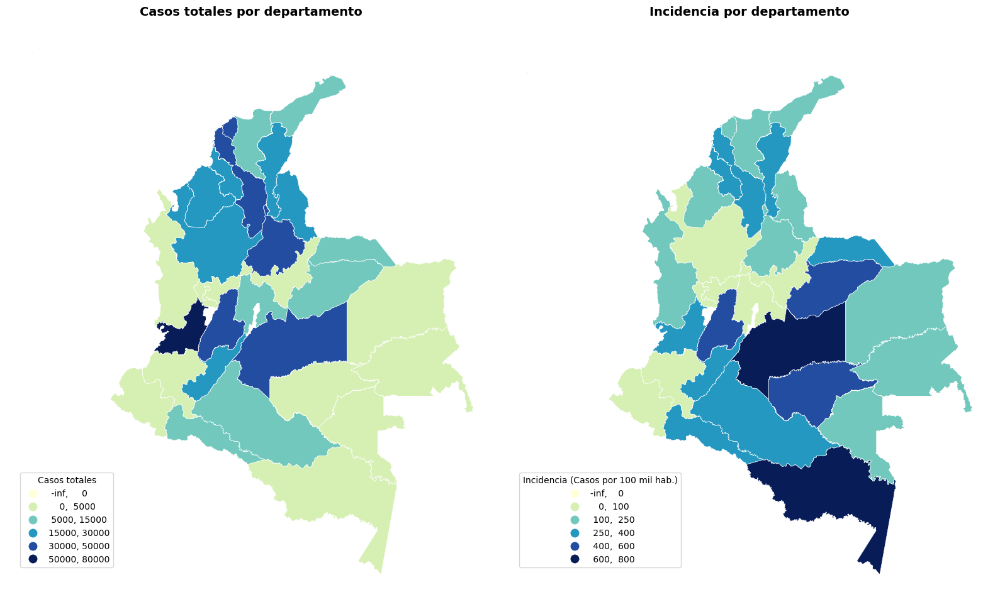
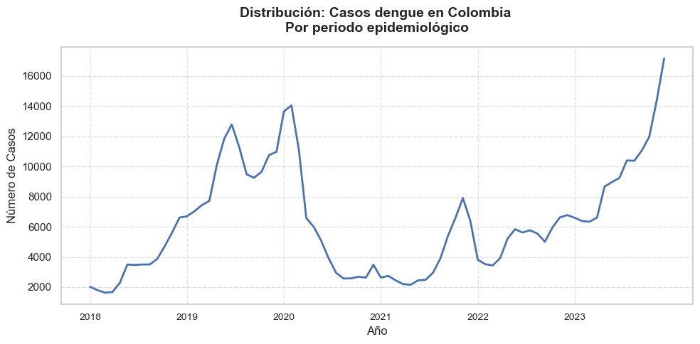
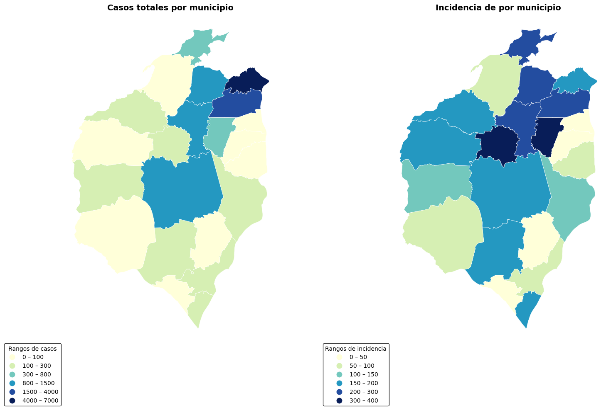
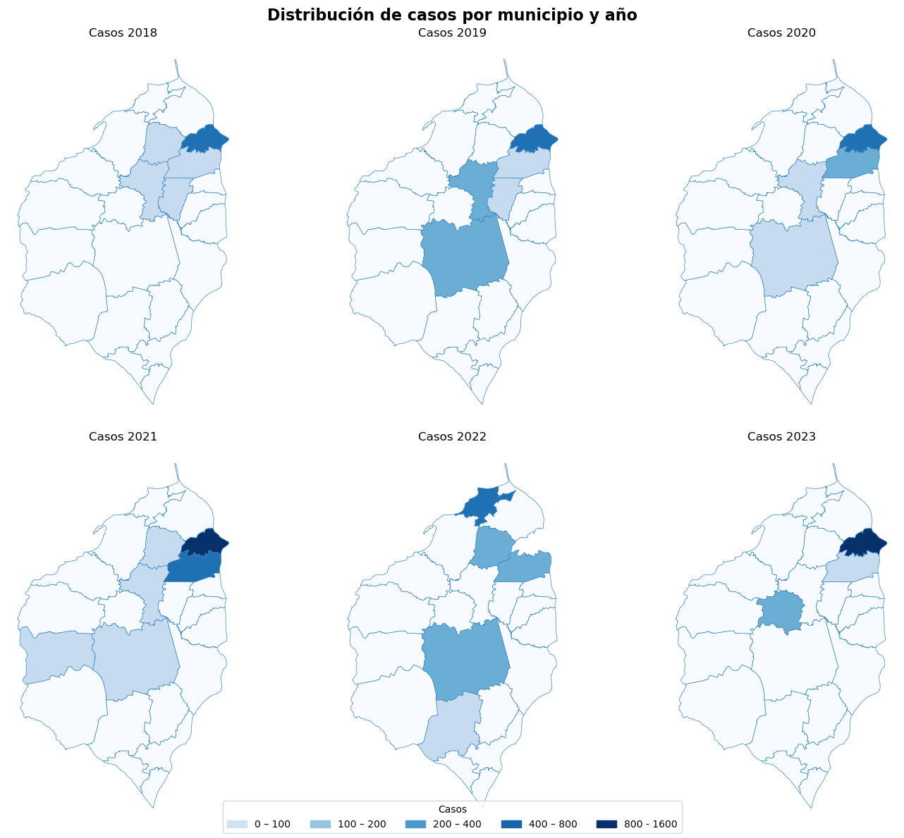
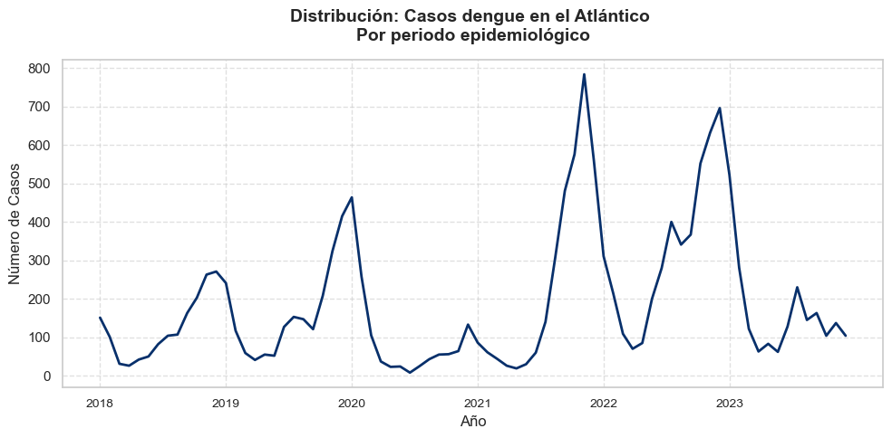
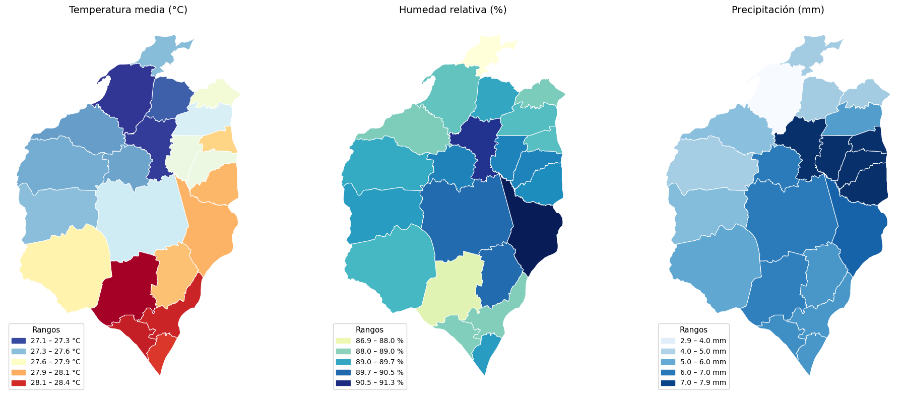
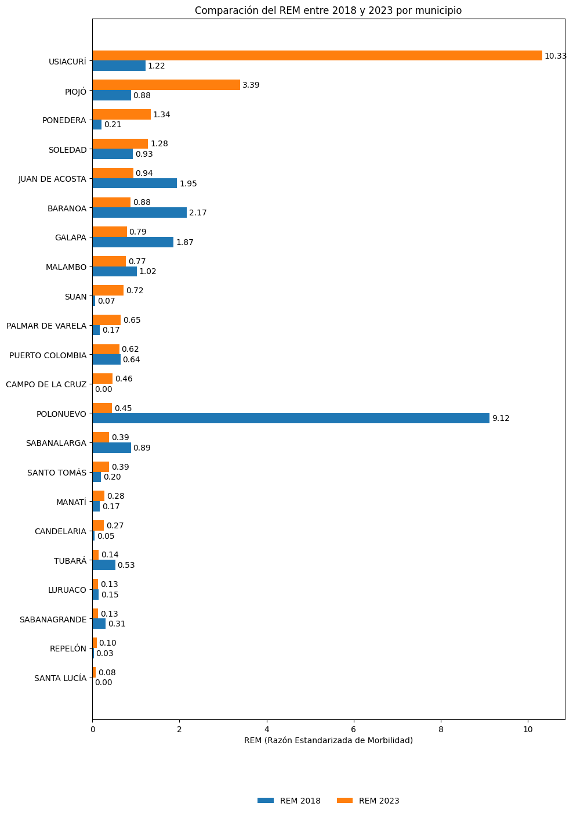

# ** Análisis de Tendencias Space-Time del Dengue en el Atlántico utilizando un Modelo Joinpoint de Efectos Mixtos: Identificación de Puntos de Inflexión Epidemiológicos y Factores Asociados**

## Introducción 

El dengue es una enfermedad febril aguda de etiología viral, transmitida por vectores del género *Aedes* (*A. aegypti* y *A. albopictus*). Según la [Organización Mundial de la Salud (OMS, 2023)](https://www.who.int/es/news-room/fact-sheets/detail/dengue-and-severe-dengue), constituye una de las mayores cargas sanitarias en regiones tropicales y subtropicales, con un estimado de 390 millones de infecciones anuales a nivel global. Su espectro clínico abarca desde cuadros leves hasta formas graves potencialmente mortales, lo que convierte su vigilancia y control en una prioridad de salud pública a nivel mundial. 

Este problema global tiene una expresión concreta en Colombia, donde el dengue representa un problema prioritario de salud pública debido a su patrón endemo-epidémico. Afecta al 73.3% de los municipios, de acuerdo con el Instituto Nacional de Salud (INS), lo que evidencia su amplia distribución territorial. La dinámica de transmisión en el territorio colombiano está ligada a condiciones locales de temperatura, lluvia y humedad. 

 Esta interacción genera variaciones regionales marcadas y un comportamiento no estacionario, con fluctuaciones que dependen tanto de la época del año como de los ciclos climáticos de mayor escala [(E. Muñoz, 2021)](https://doi-org.ezproxy.uninorte.edu.co/10.1016/j.actatropica.2021.106136 ). En el plano institucional, Colombia cuenta con un marco regulatorio que sustenta la vigilancia del evento a través del Sistema Nacional de Vigilancia en Salud Pública (SIVIGILA), que establece la notificación obligatoria de los casos. Asimismo, el Plan Decenal de Salud Pública 2022–2031 incorpora estrategias de prevención, control vectorial y educación comunitaria orientadas a reducir la transmisión.

Para caracterizar este fenómeno, el presente estudio se basa en los registros oficiales reportados al SIVIGILA, fuente primaria de información epidemiológica en Colombia. A partir de esta base de datos se realizó una caracterización descriptiva de 491,869 registros correspondientes al periodo 2018-2023, que incluye la distribución temporal de los casos, la incidencia ajustada por población expuesta y los patrones demográficos asociados al evento.

Sin embargo, el análisis a escala nacional puede ocultar dinámicas subregionales críticas. Por ello, esta investigación se enfoca específicamente en el departamento del Atlántico con un doble objetivo: primero, analizar la tasa anual de dengue por municipio (2018-2023) utilizando un Joint Point Model para identificar tendencias temporales significativas; y segundo, realizar una detección espacio-temporal de los factores de riesgo ambientales y demográficos que influyen en la incidencia de casos en este territorio. De este modo, el estudio busca proporcionar evidencia específica que contribuya a optimizar las estrategias de vigilancia y control a nivel departamental.

## Objetivos
Analizar la distribución espacio-temporal del dengue en el Atlántico mediante un modelo Joinpoint de efectos mixtos para identificar puntos de cambio en las tendencias municipales.
- Caracterizar los casos del dengue en el departamento del Atlántico.
- Determinar los puntos de quiebre temporales en la tendencia de la morbilidad por dengue a nivel municipal.
- Calcular los porcentajes de cambio por periodo (PPC) para cada segmento de tendencia.
- Identificar factores demográficos y climáticos asociados a las tendencias municipales.

-----

## 1. Caracterización de los casos de Dengue

El análisis de los 491,869 registros a nivel nacional permitió establecer un perfil base de la población afectada por dengue entre 2018 y 2023. En primer lugar, en cuanto a la distribución demográfica, durante el periodo analizado, la mayor proporción de casos correspondió a personas en edad adulta (18–59 años), con un 32.6% del total. Le siguieron los niños en primera infancia (1-5 años), con un 24.4%, y los adolescentes (12-17 años), con un 21.9%. En contraste, las personas mayores de 60 años representaron apenas el 5%. En cuanto al sexo, los casos fueron ligeramente más frecuentes en masculinos (52,4%) que en femeninas (47.6%). Solo el 5.5% de los casos correspondió a grupos étnicos reconocidos (afrocolombianos, indígenas o ROM). Con respecto al régimen de afiliación en salud, el 52.2% pertenecía al régimen subsidiado, el 39.3% al contributivo y el 8.4% a otros tipos.

Desde una perspectiva clínica, el conjunto de casos estuvo conformado por 485,139 diagnósticos de dengue clásico y 6,730 de dengue grave. El 70.2% de los registros correspondió a casos probables, mientras que el resto fueron confirmados por laboratorio o nexo epidemiológico. Aproximadamente el 48.4% de los pacientes requirió hospitalización y se registraron 158 muertes asociadas a dengue grave durante el periodo de estudio. 

Más allá de las características de los pacientes, la distribución espacial del dengue en Colombia evidencia patrones territoriales claramente diferenciados. En términos de carga absoluta, los mayores volúmenes de casos se concentraron en los departamentos con grandes centros urbanos y alta densidad poblacional. El Valle del Cauca aportó el 15.3% del total nacional, seguido por Meta (8.9%) y Tolima (8.6%), que conformaron un bloque con más de 40.000 notificaciones. De manera similar, Atlántico, Bolívar y Santander registraron más de 30.000 casos cada uno, reflejando su papel como nodos regionales con intensa movilidad humana. En contraste, territorios de baja población y amplia dispersión geográfica —como San Andrés, Providencia y Santa Catalina, Guainía, Vaupés y Vichada— reportaron menos de 1.000 casos en el periodo analizado.

Sin embargo, al complementar el análisis anterior con la incidencia, se revela un patrón espacial distinto al observado en los casos totales. Departamentos como Meta, Casanare, Guaviare, Putumayo, Caquetá y Huila presentaron los niveles más altos de riesgo proporcional, pese a no encabezar la notificación absoluta. Destaca particularmente el Amazonas, que registró la mayor incidencia del país, con 784 casos por cada 100.000 habitantes, seguido de Meta, Guaviare, Casanare y Tolima, todos con tasas superiores a 500 casos por cada 100.000 habitantes. Este comportamiento indica que la intensidad de la transmisión se concentra en áreas de llanura, piedemonte y selvas intermedias, donde el impacto relativo sobre la población es mayor.

En síntesis, y como se aprecia en la figura anterior, estos resultados confirman que la distribución del dengue en Colombia no es homogénea y responde a dinámicas territoriales diferenciadas. Mientras los grandes centros urbanos del Caribe y del suroccidente del país acumulan la mayor carga absoluta de casos, los territorios del piedemonte llanero y amazónico experimentan las tasas de incidencia más elevadas.

Este panorama espacial se complementa con el análisis de su evolución en el tiempo. l comportamiento temporal de dengue entre 2018 y 2023 mostró un patrón de fluctuaciones multianuales. Los picos epidémicos más elevados se presentaron en 2019 y 2023, con 124,989 y 128,132 notificaciones respectivamente. Estos repuntes contrastaron con los descensos observados en  2020 y 2021, cuando los casos disminuyeron a 77,281 y 50,265, posiblemente influenciados por restricciones asociadas a la pandemia por COVID-19. Los años intermedios, como 2018 (44,171) y 2022 (67,031), presentaron niveles moderados, configurando un patrón clínico característico del dengue en el país. 

Finalmente, el análisis gráfico confirma confirma un comportamiento cíclico y estacional, con incrementos sostenidos en los primeros meses de cada año y descensos posteriores. Dos picos epidémicos destacan de manera clara: uno a finales de 2019 e inicios de 2020, y otro más pronunciado hacia el segundo semestre de 2023. Tras el pico de 2020 se observó un descenso abrupto que marcó un periodo de baja transmisión entre 2020 y 2021. A partir de 2022 se evidenció un nuevo incremento, con fluctuaciones mensuales pero con una tendencia general al alza que culminó en un repunte epidémico a finales de 2023. 

Para complementar el análisis nacional, si bien este permite comprender el comportamiento general del dengue en el país, resulta necesario profundizar en dinámicas territoriales específicas. Para ello, situamos el contexto territorial en el departamento del Atlántico. Ubicado en la región caribe y conformado por 22 municipios y el Distrito Especial de Barranquilla, presenta condiciones climáticas de tipo tropical con variaciones entre estepa, sabana y zonas semiáridas, particularmente en áreas cercanas al río Magdalena y franja costera. La combinación de factores climáticos y la alta concentración urbana genera condiciones favorables para la reproducción del vector _Aedes aegypti_. Estas características hacen del Atlántico un escenario estratégico para analizar patrones locales de transmisión.

En lo que respecta a la distribución por edades en el Atlántico (exceptuando la ciudad de Barranquilla), la distribución de las 14,522 notificaciones de dengue por ciclo vital muestra una marcada concentración en población infantil y adolescente. La infancia mayor (6-11 años) agrupa 30.5% de los casos, seguida de la adolescencia (12-17 años) con el 29.8%; en conjunto representan más de la mitad de las notificaciones. En tercer lugar se ubica la población adulta (18-59 años) con el 24.9%, mientras que la infancia menor (1-5 años) aporta el 12.6%. Cabe destacar que este patrón difiere del observado a nivel nacional, donde la carga tiende a concentrarse en población adulta, evidenciando que en el Atlántico la transmisión afecta especialmente a grupos en edades tempranas.

En línea con el panorama nacional, en cuanto al perfil demográfico y la afiliación al sistema de salud, el comportamiento es similar al escenario nacional: los masculinos representan el 52.3% de los casos, manteniendo una ligera predominancia sobre las mujeres. Asimismo, el 53.4% de los pacientes pertenece al régimen subsidiado, seguido del 39.8% del régimen contributivo y un 6.8% correspondiente a otras modalidades de aseguramiento. Respecto a la severidad del evento, el 63.9% requirió hospitalización, se cuentan 380 casos (2.6%) de dengue grave; de ellos y dada la enfermedad se registraron 7 fallecimientos.

Desde una perspectiva geográfica, la distribución municipal del dengue en el departamento del Atlántico muestra contrastes marcados entre áreas metropolitanas y territorios periféricos. Soledad concentra el 46% de todos los casos reportados (6,673 registros), seguida por Malambo (11.5%), Sabanalarga (7.5%) y Baranoa (7.0%), conformando los principales focos urbanos de transmisión. Estos municipios se caracterizan por su alta densidad poblacional, urbanización rápida y amplios flujos de movilidad, lo que favorece la acumulación de casos. Por el contrario, municipios como Santa Lucía, Santo Tomás, Piojó, Tubará y Candelaria aportan menos del 1% de las notificaciones, en coherencia con su menor población y actividad urbana.

No obstante, al analizar la incidencia, el patrón espacial se transforma de manera significativa. Los mayores niveles de riesgo proporcional se observan en Polonuevo (336.76 casos por 100,000 habitantes), Usiacurí (308.66) y Baranoa (251.98), municipios que no lideran en número absoluto de casos, pero sí presentan un impacto relativo mucho mayor sobre su población. Puerto Colombia, Galapa y Malambo también registran incidencias superiores a los 200 casos por 100,000 habitantes, consolidando un corredor central y nororiental con transmisión intensa. En contraste, Candelaria, Sabanagrande, Santo Tomás y Santa Lucía mantienen incidencias menores a 50 casos por 100,000 habitantes, identificándose como zonas de menor afectación.

La dinámica de casos notificados por municipio y año revela patrones epidemiológicos distintivos. A lo largo del periodo analizado, la mayoría de los municipios no superaron los 100 casos anuales. Sin embargo, se observan concentraciones geográficas variables: Durante los primeros tres años, la carga de casos se localizó predominantemente en la región centro-oriental del departamento, específicamente en el bloque conformado por Baranoa, Galapa,  Malambo, Polonuevo, Soledad y Sabanalarga, los cuales registraron entre 100 y 400 casos anuales cada uno. En el trienio siguiente, la tendencia cambió significativamente, identificándose nuevos focos de intensificación. Municipios como Malambo (2021) y Puerto Colombia (2022) experimentaron repuntes notorios, superando los 400 casos en un solo año, mientras que soledad alcanzó sus registros más altos de más de 800 casos. Este patrón se acentuó en 2022, cuando Sabanalarga, Galapa y Malambo rebasaron conjuntamente la marca de 400 notificaciones, en este mismo año el municipio de Soledad superó el record de 2,125 notificaciones. Finalmente, en 2023, el panorama destacó por un pico pronunciado en Usiacurí, que reportó más de 200 casos.

En conjunto, estos patrones confirman que el dengue en el Atlántico no se distribuye de manera homogénea y que los casos totales y el riesgo relativo responden a dinámicas territoriales distintas. Mientras el volumen absoluto de casos se concentra en los grandes centros urbanos que integran el área metropolitana de Barranquilla, las mayores tasas de incidencia se localizan en municipios intermedios del centro del departamento. 

En el ámbito temporal, la dinámica temporal del dengue en el Atlántico presenta un comportamiento fluctuante y marcadamente estacional. Los años con mayor número de casos fueron 2021 (3,172) y 2022 (4,257), contrastando con los descensos observados en 2020 y 2023, cuando las notificaciones bajaron a 1,295 y 2,144 respectivamente. Como se aprecia en la figura anterior, la serie por periodo epidemiológico entre 2018 y 2023 evidencia varios picos relevantes: uno a finales de 2019 e inicios de 2020 con cerca de 450 casos por periodo; un segundo y más alto en 2022 (más de 780); y otro hacia finales de 2023 (alrededor de 700). A lo largo de toda la serie se observan ciclos de incrementos rápidos seguidos por descensos bruscos. El patrón general indica un descenso en la primera mitad del año y un aumento marcado en la segunda, configurando un comportamiento cíclico y estacional.

Una vez caracterizado el comportamiento epidemiológico del dengue en el departamento del Atlántico, es pertinente examinar los factores del entorno que pueden influir en la transmisión del virus. Entre estos, las variables climáticas desempeñan un papel fundamental, dado que condicionan tanto la presencia del _Aedes Aegypti_ como la velocidad de su ciclo de vida y la replicación viral. Esta relación está bien establecida en la literatura científica para el contexto colombiano. Por ejemplo, [Muñoz et al. (2021)](https://doi.org/10.1016/j.actatropica.2021.106136) evidenciaron una fuerte asociación no estacionaria entre los casos de dengue y variables climáticas locales como la temperatura y la precipitación a nivel nacional, destacando que esta influencia varía espacial y temporalmente.

Para caracterizar estas relaciones de manera más precisa, es crucial considerar la complejidad de su interacción. Estudios recientes enfatizan que el efecto del clima sobre el dengue no es inmediato ni lineal. En linea con esto, [Ortega-Lenis et al. (2024)](https://doi.org/10.1371/journal.pone.0311607), en un estudio en el Valle del Cauca, desarrollaron un modelo jerárquico bayesiano espaciotemporal que integra efectos no lineales y rezagados de variables climáticas, encontrando que este enfoque ofrece el mejor ajuste estadístico. Sus resultados cuantifican cómo un aumento en la temperatura media se asocia con un incremento del 35% en el riesgo de dengue con 0-2 meses de retraso, mientras que la precipitación alta afecta el riesgo aproximadamente 2-3 meses después.

Con base en esta evidencia metodológica y empírica, el presente estudio incorpora la precipitación, la temperatura media y la humedad relativa —considerando sus potenciales efectos no lineales y de rezago— para explorar la relación entre las condiciones del entorno y el comportamiento epidemiológico del dengue en el Atlántico. Los datos climáticos para este análisis fueron proporcionados por el Copernicus Climate Change Service (C3S) a través del Atmosphere Monitoring Service [(CAMS)](https://cds.climate.copernicus.eu/datasets?kw=Temporal+coverage%3A+Past).

En cuanto a los resultados del análisis climático, la distribución determina que la media osciló entre 25.1°C y 30.2°C, con un promedio general de 27.7°C (± 0.9°C), con registros extremos que variaron entre 23.9°C y 31.6°C. A lo largo del tiempo mostró una marcada variabilidad estacional, alcanzando los valores más altos hacia la mitad de cada año. A nivel espacial, se evidencia un predominio del calor hacia el sur y sureste del departamento, especialmente en municipios como Manatí, Candelaria, Santa Lucía y áreas vecinas, que se destacan como los sectores más cálidos del Atlántico. En contraste, municipios como Tubará, Baranoa y sus alrededores presentan temperaturas más moderadas, propias de las zonas costeras y con mayor elevación. De este modo, el patrón térmico parece estar influido principalmente por la proximidad al mar y las variaciones en el relieve, que generan microclimas locales más frescos. 

Respecto a la humedad relativa, se observa un comportamiento casi inverso al de la temperatura. Los valores más altos se concentran en el centro del departamento y en el suroccidente, áreas cercanas al río Magdalena, donde la humedad se mantiene elevada. Por el contrario, la zona nororiental es la más seca, debido a la incidencia de las brisas marinas que reducen la saturación de humedad en esta franja costera. En el tiempo, presenta un patrón cíclico anual, con los valores más altos concentrados en el tercer trimestre del año y los más bajos en el primero fluctuando entre 78.2% y 98.4%, alcanzando un mínimo extremo de 73.6%. 

Finalmente, en lo que se refiere a la presenta un patrón bien definido con una alta variabilidad diaria y registros de lluvia entre 0 y 20.9 mm³, con una mediana de 2.83 mm³ y casos extremos de precipitaciones de hasta 108.9 mm³. El sector oriental del departamento, comprendido por municipios como Candelaria, Santo Tomás, Palmar de Varela, Polonuevo y Baranoa, registra las mayores acumulaciones de lluvia. En contraste, la zona occidental, especialmente municipios como Piojó, Juan de Acosta y, de manera más marcada, Tubará, muestran los niveles más bajos de precipitación. Esta distribución responde a que el costado occidental es más seco por su mayor altitud, mientras que el oriental recibe la influencia directa de la cuenca baja del río Magdalena, lo que favorece una mayor humedad y formación de lluvias.

En resumen, estos hallazgos climáticos proporcionan el contexto ambiental necesario para interpretar las dinámicas de transmisión del dengue previamente descritas en el departamento del Atlántico, sentando las bases para analizar las relaciones entre variables climáticas y epidemiológicas.

______
## 2. Razón Estandarizada de Morbilidad
La distribución de casos notificados identifica las zonas de mayor carga absoluta de la enfermedad; sin embargo, no discrimina entre la ocurrencia esperada por el tamaño poblacional y el exceso de riesgo atribuible a dinámicas locales de transmisión. Para complementar el análisis de incidencia y cuantificar el riesgo relativo municipal, se calculó la Razón Estandarizada de Morbilidad (REM), definida como el cociente entre los casos observados en un municipio y los casos esperados, bajo el supuesto de que la tasa de incidencia departamental se aplica de manera uniforme.

$$ REM_i = \frac{O_i}{E_i} $$
donde:
- $O_i$ = Número de casos observados en el municipio $i$
- $E_i$ = Número de casos esperados en el municipio $i$, calculado como $E_i = \text{Población}_i \times \text{Tasa de incidencia departamental}$

Interpretación del indicador:
- $REM = 1$: La morbilidad observada coincide con la esperada.
- $REM > 1$: Exceso de riesgo (morbilidad superior a la esperada).
- $REM < 1$: Déficit de riesgo (morbilidad inferior a la esperad). 

Este indicador es particularmente útil para identificar desviaciones significativas del patrón esperado, destacando tanto áreas de alto riesgo relativo como territorios con transmisión contenida. La integración de la incidencia y la REM permite una caracterización bidimensional del comportamiento epidemiológico: la primera cuantifica la frecuencia de la enfermedad y la segunda, la sobrecarga relativa en cada contexto municipal.

Para operacionalizar este indicador, los datos de población municipal necesarios para el cálculo de los casos esperados se obtuvieron de las proyecciones demográficas del Departamento Administrativo Nacional de Estadística (DANE) para el año 2018. A partir de esta fuente, se calcularon los casos esperados para cada municipio del departamento aplicando la tasa de incidencia departamental a su población específica. En la Tabla 1 se presentan los datos de población, incidencia municipal, casos observados, casos esperados y la REM resultante para cada municipio en el consolidado 2018-2023.

| Municipio        | Casos Observados | Proporción | Población | Incidencia | Casos Esperados |   REM   |
|------------------|-------|------------|-----------|------------|-----------|---------|
| BARANOA          | 1021  | 0.070      | 405184    | 251.98     | 681.512   | 1.49814 |
| CAMPO DE LA CRUZ | 147   | 0.010      | 147981    | 99.34      | 248.785   | 0.59087 |
| CANDELARIA       | 52    | 0.004      | 104398    | 49.81      | 175.695   | 0.29597 |
| GALAPA           | 837   | 0.058      | 391774    | 213.64     | 657.891   | 1.27225 |
| JUAN DE ACOSTA   | 249   | 0.017      | 134313    | 185.39     | 225.477   | 1.10433 |
| LURUACO          | 271   | 0.019      | 181093    | 149.65     | 304.225   | 0.89079 |
| MALAMBO          | 1675  | 0.115      | 832032    | 201.31     | 1398.510  | 1.19770 |
| MANATÍ           | 253   | 0.017      | 128844    | 196.36     | 216.718   | 1.16742 |
| PALMAR DE VARELA | 100   | 0.007      | 188904    | 52.94      | 317.916   | 0.31455 |
| PIOJÓ            | 69    | 0.005      | 42781     | 161.29     | 71.924    | 0.95934 |
| POLONUEVO        | 394   | 0.027      | 116997    | 336.76     | 196.548   | 2.00460 |
| PONEDERA         | 186   | 0.013      | 152362    | 122.08     | 255.750   | 0.72727 |
| PUERTO COLOMBIA  | 766   | 0.053      | 333634    | 229.59     | 563.463   | 1.35945 |
| REPELÓN          | 95    | 0.007      | 167696    | 56.65      | 281.551   | 0.33742 |
| SABANAGRANDE     | 94    | 0.006      | 211268    | 44.49      | 355.591   | 0.26435 |
| SABANALARGA      | 1083  | 0.075      | 590598    | 183.37     | 990.362   | 1.09354 |
| SANTA LUCÍA      | 41    | 0.003      | 104634    | 39.18      | 176.092   | 0.23283 |
| SANTO TOMÁS      | 73    | 0.005      | 195560    | 37.33      | 329.282   | 0.22170 |
| SOLEDAD          | 6673  | 0.460      | 3935846   | 169.54     | 6619.400  | 1.00810 |
| SUAN             | 119   | 0.008      | 77623     | 153.31     | 130.573   | 0.91137 |
| TUBARÁ           | 74    | 0.005      | 112015    | 66.06      | 188.210   | 0.39318 |
| USIACURÍ         | 250   | 0.017      | 80996     | 308.66     | 136.519   | 1.83125 |

Tabla 1. Datos poblacionales, de incidencia y cálculo de la Razón Estandarizada de Morbilidad (REM) para los municipios del departamento del Atlántico (2018-2023).

La distribución espacio-temporal de la REM, vizualizada en el mapa de calor, revela una evolución en la indensidad y focalización del dengue en el departamento. En el primer trienio (2018-2020) se identifican focos de alta morbilidad, donde los casos superaron significativamente lo esperado. El municipio de Polonuevo (2018 - 2019) se destaca por un valor excepcionalmente alto (REM > 4),alcanzando un pico de  9.12 en el 2018, lo que lo consolidó como el epicentro de la enfermedad. Junto a este, Baranoa, Sabanalarga y Repelón presentaron razones superiores a 2,  conformando otros núcleos de alta transmisión. También se destacan, con más casos de los esperados, los municipios de Juan de Acosta y Galapa (2018), Manatí y Ponedera (2019), y Malambo (2020). Este patrón de alta carga relativa difiere del descrito para el número absoluto de casos netos, subrayando la utilidad de la REM para identificar desproporciones epidemiológicas.

Para el segundo trienio (2021-2023) se observa una reconfiguración en la aparición de nuevos epicentros. La mayoría del territorio muestra una notable reducción (REM < 1), lo que indica una morbilidad dentro o por debajo de lo esperado. Sin embargo, surgen focos nuevos y aislados. Luruaco y Malambo (2021), junto con Manatí y Puerto Colombia (2022), se convierten en los puntos de mayor morbilidad (REM > 2), mostrando un pico notorio en el contexto departamental. Resulta llamativa la lejanía geográfica entre estos pares de municipios, lo que sugiere dinámicas de transmisión localizadas e independientes. Para 2023, Usiacurí se convierte en el epicentro absoluto, registrando el valor de REM más alto de todo el periodo (10.33). Así, es posible determinar una transición entre trienios que ilustra un escenario epidemiológico cambiante: se pasa de una epidemia intensa y multifocal a una situación de control basal con brotes esporádicos pero extremadamente severos.

La comparación de la REM entre 2018 y 2023, remarca el cambio de la configuración de la morbilidad. Hacia el final del periodo estudiado, los municipios de Usiacurí, Piojó, Ponedera y Soledad, son los que mayor morbilidad por dengue presentan, superando el valor obtenido al inicio del periodo. Otros 8 municipios tamhién aumentaron la morbilidad, en contraste a los 10 restantes, donde la morbilidad bajó considerablemente.

Autoras: 
* Daniella Guerra Gutiérrez
* Tawny Torres Caballero

Tutores:
* PhD. Karen Florez Lozano
* Edgar Navarro